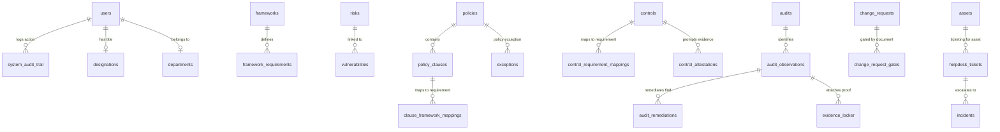

# Walkthrough: Database Schema Implementation for TSI Compass (IT GRC Tool)

We have created the SQL initialization script [init.sql](file:///home/tsi/tsi-compass/db/init.sql) in the `db` folder. This script prepares the PostgreSQL database for all functional components of the GRC tool.

---

## 1. Database Architecture & Design

The database uses **UUIDs** as primary keys for all tables (utilizing the `uuid-ossp` extension) and implements strict foreign keys, checks, and status validation constraints to ensure high data integrity.

### Data Modules Map

---

## 2. Advanced Features Implemented

### 2.1 Tamper-Proof Cryptographic Audit Trail
To satisfy the requirement of an **immutable, tamper-proof system ledger**, we created the `system_audit_trail` table with two specific database-enforced safeguards:
1. **Hash Chaining (Trigger `trg_system_audit_trail_hash_chain`)**:
   Before a new audit log is written, the database calculates a cumulative SHA-256 hash chaining the previous record's hash with the current record's details (ID, timestamp, user, action, and JSON payload):
   $$\text{log\_hash} = \text{SHA256}(\text{id} \parallel \text{timestamp} \parallel \text{user\_id} \parallel \text{action} \parallel \text{details} \parallel \text{previous\_hash})$$
2. **Immutability Enforcement (Trigger `trg_prevent_audit_log_update`)**:
   Any operation attempting to `UPDATE` or `DELETE` existing log entries triggers an exception, blockading manual alterations of the audit ledger.

### 2.2 Dynamic Risk Scoring
The `risks` table utilizes PostgreSQL's native generated columns to dynamically evaluate risk criticality based on the inherent variables:
- `inherent_risk_score` is automatically evaluated as `(inherent_impact * inherent_likelihood)`.
- Input validation limits impact and likelihood between 1 and 5.

---

## 3. Seed Data
The database is pre-seeded with foundational data to make the app ready for use immediately upon deployment:
- **Offices & Departments**: Seeding Head Office (Mumbai), Regional Offices (North/South), and IT/Audit/Risk departments.
- **Designations & KRAs**: Seeding Roles (CIO, Risk Manager, Auditor, Compliance Officer, IT Support) with security-linked KRAs.
- **Default Administrator**: Creating an admin account (`admin@tsiconsulting.com`) with a pre-computed BCrypt hash of `secure_admin123`.
- **Committees**: Seeding IT Strategy Committee, IT Steering Committee, and Risk Board.
- **Compliance Frameworks & Requirements**: Mapping ISO 27001 (A.5.1, A.8.20), GDPR (Article 32), and SOC 2.
- **Regulators**: Adding RBI and DPA records.
